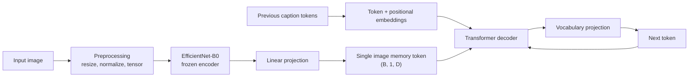

# Image Captioning with a Frozen CNN Encoder and Transformer Decoder

This project is a notebook-first PyTorch implementation of image captioning: given an input image, it generates a short natural-language description. The model combines a pretrained `EfficientNet-B0` visual encoder used as a frozen feature extractor with a trainable Transformer decoder that generates captions autoregressively. The goal is not to claim benchmark performance or production readiness, but to demonstrate a clear, end-to-end multimodal learning pipeline covering dataset preparation, tokenization, modeling, training, checkpointing, and inference in Google Colab.

Notebook: [Open in Google Colab](https://colab.research.google.com/drive/14ACz8svsl2cJr9xwEZ44F2cj5-yL8GbC?usp=sharing)

## Key Features / Highlights

- Frozen `EfficientNet-B0` encoder built with `timm` for transfer learning from pretrained visual features.
- Trainable linear projection that maps CNN features into the Transformer decoder hidden space.
- Multi-layer `nn.TransformerDecoder` with learned token and positional embeddings for autoregressive caption generation.
- Custom word-level vocabulary pipeline using NLTK `wordpunct_tokenize`.
- Albumentations-based image preprocessing with ImageNet normalization and lightweight training augmentation.
- Teacher-forced next-token training with causal masking, padding masks, AMP, and gradient clipping.
- Inference that supports both greedy decoding and temperature-based sampling with optional `top_k`.
- Notebook-first workflow that makes the full modeling pipeline easy to inspect and discuss in interviews.

## Demo / Example Output

Sample generated caption from the notebook:

> a young boy wearing a red helmet rides his bicycle down a road

Example qualitative outputs captured from notebook runs:


## Project Motivation / Why I Built This

I built this project to understand image captioning as a true multimodal problem rather than as separate computer vision and NLP exercises. The focus was on learning how to connect a pretrained visual backbone to a language model, build a custom captioning dataset pipeline, train the system end to end, and reason about practical tradeoffs in model design. It is intentionally compact and notebook-centric so the entire workflow is visible in one place and easy to explain.

## Architecture Overview



At a high level, the encoder turns each image into one pooled feature vector, the projection layer maps that vector into the decoder hidden dimension, and the Transformer decoder predicts caption tokens one step at a time. A key simplification is that the decoder attends to a single pooled image token instead of spatial feature maps or patch embeddings. That keeps the model easy to reason about, but it also limits fine-grained grounding and detailed scene understanding.

## How It Works

1. Parse `captions.txt` into `(image filename, caption)` pairs and expand multiple captions per image into one row per training example.
2. Build a word-level vocabulary from caption frequencies, then convert each caption into integer token IDs with `<START>`, `<END>`, and `<PAD>` handling.
3. Load each image with OpenCV, apply resizing and normalization, and optionally apply light training augmentation.
4. Encode the image once with a frozen `EfficientNet-B0`, then project the pooled feature vector into the decoder embedding space.
5. Train the Transformer decoder with teacher forcing so it predicts the next caption token conditioned on both prior tokens and the image representation.
6. During inference, preprocess the image, encode it once, and autoregressively decode tokens until `<END>` is generated or the maximum context length is reached.

## Dataset

The notebook is written around the Flickr8k dataset, expected in Google Drive under `Flickr8kVersion/`.

- Dataset source: [Flickr8k on Kaggle](https://www.kaggle.com/datasets/adityajn105/flickr8k/data)
- Expected structure:

```text
Flickr8kVersion/
|-- Images/
|   `-- *.jpg
`-- captions.txt
```

- `captions.txt` is read line by line and parsed into image-caption pairs.
- Images with multiple captions are expanded into multiple rows in a Pandas DataFrame.
- One known missing image is explicitly skipped to avoid training failures:
  `2258277193_586949ec62.jpg`

## Tokenization and Preprocessing

### Text preprocessing

- Tokenizer: NLTK `wordpunct_tokenize`
- Normalization:
  - lowercase every token
  - keep only alphanumeric tokens with `t.isalnum()`
- Vocabulary is built from token frequency counts across all captions.
- Special tokens:
  - `<UNKNOWN>` -> id `0`
  - `<PAD>` -> id `1`
  - `<START>` -> id `2`
  - `<END>` -> id `3`
- Captions are converted to:
  `[<START>] + tokens + [<END>]`
- Fixed context length: `20`
- Short captions are padded with `<PAD>`.
- Long captions are truncated and forced to end with `<END>`.

### Image preprocessing

- Load images with OpenCV.
- Convert `BGR -> RGB`.
- Resize to `224 x 224`.
- Normalize with ImageNet mean and standard deviation.
- Convert to tensors with `ToTensorV2()`.
- Training-time augmentation includes:
  - `HorizontalFlip()`
  - `ColorJitter()`

## Model Architecture

Model class: `ImageCaptioner`

| Component | Implementation |
|---|---|
| Visual encoder | `timm.create_model('efficientnet_b0', pretrained=True, num_classes=0, global_pool='avg')` |
| Encoder output | One pooled feature vector per image |
| Bridge layer | `nn.Linear(in_features, model_dim)` |
| Token embeddings | `nn.Embedding(vocab_size, model_dim)` |
| Positional embeddings | `nn.Embedding(context_length, model_dim)` |
| Decoder | `nn.TransformerDecoder` built from `nn.TransformerDecoderLayer(...)` |
| Output head | `nn.Linear(model_dim, vocab_size)` |

Decoder configuration from the notebook:

- `model_dim = 512`
- `num_blocks = 6`
- `num_heads = 16`
- `dropout = 0.1`
- `context_length = 20`

Important modeling choice:

- The image is reduced to a single global feature vector.
- That vector is projected and reshaped into Transformer memory of shape `(B, 1, D)`.
- The decoder therefore attends to one image memory token rather than a spatial grid of visual features.

This is a meaningful design tradeoff. It keeps the architecture compact and makes the vision-language interface easy to inspect, but it also limits the model's ability to localize fine details or reason about multiple regions independently.

The decoder uses:

- a causal mask to prevent attention to future tokens during training
- a padding mask to ignore `<PAD>` tokens in caption sequences

## Training Setup

Training is performed with teacher forcing for next-token prediction.

- Inputs: caption tokens shifted right
- Targets: caption tokens shifted left
- Loss: `CrossEntropyLoss(ignore_index=<PAD>)`
- Optimizer: `AdamW(lr=2e-5, weight_decay=0.01)`
- Gradient clipping: `2.0`
- AMP: enabled when CUDA is available
- Frozen encoder behavior:
  - `requires_grad = False` for encoder parameters
  - encoder forward pass runs under `torch.no_grad()`
  - encoder is kept in eval mode during training for BatchNorm stability

DataLoader configuration in the notebook:

- `num_epochs = 40`
- `batch_size = 128`
- `shuffle = True`
- `num_workers = 8`
- `pin_memory = True`
- `persistent_workers = True`
- `prefetch_factor = 2`

Weights are saved in the notebook as:

```python
torch.save(model.state_dict(), "weights.pt")
```

## Inference / Caption Generation

Caption generation is implemented in `generate_caption(...)`.

Inference flow:

1. Preprocess the image with the same resize and normalization pipeline used in training, without augmentation.
2. Encode the image once with the frozen CNN.
3. Project the image feature into decoder memory.
4. Generate tokens autoregressively until `<END>` is produced or the context limit is reached.

Decoding options:

- Greedy decoding when `temperature <= 0`
- Stochastic sampling when `temperature > 0`
- Optional `top_k` filtering
- `<PAD>` and `<START>` are blocked from being sampled as next tokens

Example call used in the notebook:

```python
caption = generate_caption(
    model=model,
    image_path=image_path,
    vocabulary=vocabulary,
    context_length=context_length,
    device=device,
    temperature=0.6,
    top_k=50,
)
print(caption)
```

## Results

This project is best read as a qualitative learning project rather than a benchmarked experiment.

- The notebook includes sanity checks that decode tokenized captions back into readable text.
- Saved notebook outputs show early average training loss moving from `0.7888` to `0.7816` to `0.7760` across the first three completed epochs shown.
- A sample generated caption from inference is:
  `a young boy wearing a red helmet rides his bicycle down a road`

Additional qualitative examples from the notebook:


These results are useful as directional evidence that the pipeline is learning caption structure and basic scene semantics, but the repository does not include formal evaluation metrics or held-out benchmark reporting.

## Limitations

- No practical train/validation/test split is implemented in the current notebook workflow.
- No quantitative captioning metrics such as BLEU, CIDEr, METEOR, or ROUGE are reported.
- Captions are capped at a context length of `20`, which limits descriptive richness.
- The decoder attends to a single pooled image token rather than richer spatial feature maps.
- The workflow is notebook-centric and depends on Google Colab / Google Drive conventions.
- The repository is intentionally educational and portfolio-oriented, not packaged as a reusable library or service.

These limitations are part of the tradeoff that makes the project compact, readable, and easy to discuss, while still covering the core mechanics of multimodal sequence generation.

## Tech Stack

- Python
- PyTorch
- `timm`
- Albumentations
- OpenCV
- NLTK
- Pandas
- Google Colab

## Repository Structure

```text
.
|-- .gitignore
|-- LICENSE
|-- README.md
|-- image_captioning_transformer.ipynb
|-- Screenshot 2026-02-10 182218.png
|-- Screenshot 2026-02-10 182620.png
|-- Screenshot 2026-02-10 182741.png
|-- Screenshot 2026-02-10 182906.png
`-- Screenshot 2026-02-10 183541.png
```

## Setup / Installation

> Practical note: the Flickr8k dataset is not included in this repository, and trained weights such as `weights.pt` are not checked in. You will need to provide the dataset yourself and either train the model or load your own saved checkpoint.

The notebook is written for Google Colab and directly uses `google.colab.drive` and `files.upload()`. If you want to run it locally, you will need to adapt the Drive-mount and upload cells.

Install the Python packages used in the notebook. A typical setup looks like:

```bash
pip install torch torchvision timm albumentations opencv-python pandas nltk matplotlib pillow
```

If you are using Google Colab, PyTorch is often already available and you may only need to install the additional packages used by the notebook.

## How to Run

1. Open `image_captioning_transformer.ipynb` in Google Colab or a compatible notebook environment.
2. Install the required Python packages used in the notebook.
3. Place the dataset in Google Drive with this structure:

   ```text
   drive/MyDrive/Flickr8kVersion/
   |-- Images/
   `-- captions.txt
   ```

4. Run the notebook cells in order:
   - dependency setup
   - dataset loading
   - tokenization and vocabulary building
   - model definition
   - training
   - checkpoint saving
5. For inference:
   - load `weights.pt` if you already trained the model
   - upload an image through the notebook
   - run the caption generation cell

If you already have trained weights, the notebook notes that you can skip the training cells and load the checkpoint before running inference.

## Future Improvements

- Add proper train, validation, and test splits.
- Report captioning metrics such as BLEU, CIDEr, METEOR, or ROUGE.
- Replace the single pooled memory token with spatial features so the decoder can attend to richer visual structure.
- Fine-tune part of the visual encoder instead of keeping it fully frozen.
- Try a stronger visual backbone such as ViT, ConvNeXt, or CLIP-style features.
- Explore a stronger language decoder or pretrained language-model initialization.
- Refactor the notebook into reusable modules for improved portability and experimentation.

## What This Project Demonstrates

- Understanding of encoder-decoder multimodal modeling in PyTorch
- Practical transfer learning with a frozen pretrained vision backbone
- Building a custom caption tokenization and vocabulary pipeline
- Training an autoregressive Transformer decoder with causal masking
- Applying image preprocessing and lightweight augmentation for multimodal learning
- Managing the full notebook workflow from data loading to inference
- Awareness of architectural tradeoffs, simplifications, and next-step improvements

## Summary

This repository is a compact but technically serious image captioning project that connects pretrained visual features to a Transformer language decoder in a way that is easy to inspect and explain. It is intentionally scoped as a learning and portfolio project, but it still demonstrates the full workflow and many of the core ideas behind modern multimodal sequence generation systems.
